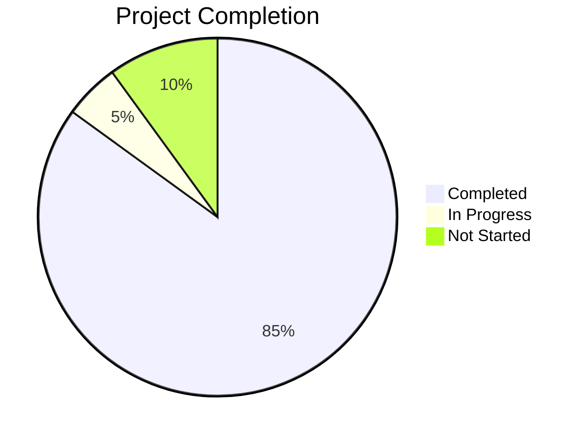

# σ₅: Progress Tracker - MCP Server Controller
*v1.0 | Created: 2025-04-09 | Updated: 2025-07-05*
*Π: DEVELOPMENT | Ω: EXECUTE*

## 📈 Project Status
Completion: 85%

## ✅ What Works

[F₁] [✅] **MCP Server Models** - Pydantic models for server configuration and status [↗️langconnect/models/mcp_server.py]
[F₂] [✅] **Docker Manager Service** - Container lifecycle management with health checks [↗️langconnect/services/docker_manager.py]
[F₃] [✅] **MCP Registry Service** - Database-based server metadata management [↗️langconnect/services/mcp_registry.py]
[F₄] [✅] **Auth Manager Service** - JWT token management with auto-refresh [↗️langconnect/services/auth_manager.py]
[F₅] [✅] **MCP Controller API** - RESTful endpoints for server management [↗️langconnect/api/mcp_controller.py]
[F₆] [✅] **MCP Dockerfile** - Container image for MCP servers [↗️mcp/Dockerfile]
[F₇] [✅] **Docker Compose Profile** - MCP image build profile [↗️docker-compose.yml]
[F₈] [✅] **Server Integration** - MCP Controller integrated into main API [↗️langconnect/server.py]
[F₉] [✅] **MCP Types & API Client** - TypeScript types and API client [↗️next-connect-ui/src/types/mcp.ts, lib/api/mcp.ts]
[F₁₀] [✅] **MCP Dashboard UI** - Main dashboard page with server stats [↗️next-connect-ui/src/app/(protected)/mcp/page.tsx]
[F₁₁] [✅] **Server List Component** - Server list with actions [↗️next-connect-ui/src/components/mcp/ServerList.tsx]
[F₁₂] [✅] **Server Control Buttons** - Start/stop/restart controls [↗️next-connect-ui/src/components/mcp/ServerControlButtons.tsx]
[F₁₃] [✅] **Server Details Dialog** - Detailed server information [↗️next-connect-ui/src/components/mcp/ServerDetailsDialog.tsx]
[F₁₄] [✅] **Real-time Log Viewer** - SSE-based log streaming UI [↗️next-connect-ui/src/components/mcp/ServerLogsDialog.tsx]
[F₁₅] [✅] **Create Server Dialog** - Server creation form with tabs [↗️next-connect-ui/src/components/mcp/CreateServerDialog.tsx]
[F₁₆] [✅] **Elicitation Dialog** - Interactive AI tool UI [↗️next-connect-ui/src/components/mcp/ElicitationDialog.tsx]
[F₁₇] [✅] **Korean Translations** - Complete Korean UI translations [↗️next-connect-ui/src/translations/ko.ts]
[F₁₈] [✅] **Sidebar Integration** - MCP menu added to sidebar [↗️next-connect-ui/src/components/layout/app-sidebar.tsx]

## ⏳ What's In Progress

[F₁₉] [⏳50%] **Integration Testing** - End-to-end testing with Docker
[F₂₀] [⏳10%] **Documentation** - API docs and user guides

## 🔜 What's Left To Build

[F₂₁] [🔜] [HIGH] **Backend Unit Tests** - Complete test coverage for all services
[F₂₂] [🔜] [MED] **Performance Monitoring** - Resource usage visualization in UI
[F₂₃] [🔜] [LOW] **Enhanced Error Handling** - Better error messages and recovery
[F₂₄] [🔜] [LOW] **Batch Operations** - Bulk server management features

## ⚠️ Known Issues

[I₁] [⚠️] [MED] **Token Refresh in Container** - Need to update running container env vars when token refreshes
[I₂] [⚠️] [LOW] **Health Check Implementation** - MCP servers need /health endpoint for Docker health checks

## 🏁 Milestones

[M₁] [2025-07-05] [✅] **Phase 1: Backend Core** - All backend services implemented
[M₂] [2025-07-05] [✅] **Phase 2: Frontend UI** - Complete UI implementation
[M₃] [2025-07-08] [🔜] **Phase 3: Integration Testing** - Full system testing
[M₄] [2025-07-10] [🔜] **Phase 4: Documentation & Deploy** - Production ready

## 📊 Quality Gate Status

[Κ₁] [✅] **PRD Approval** - Requirements documented in σ₁
[Κ₂] [✅] **Design Review** - Architecture documented in σ₂
[Κ₃] [✅] **Code Review** - Backend and frontend complete
[Κ₄] [⏳] **QA Signoff** - Awaiting test completion
[Κ₅] [🔜] **Deployment Approval** - Pending QA

## 🔍 Today's Achievements (2025-07-05)

✅ Completed full backend implementation:
- Docker Manager with container lifecycle management
- MCP Registry with PostgreSQL integration
- Auth Manager with JWT auto-refresh
- MCP Controller API with all CRUD operations
- Docker image and compose configuration
- Server.py integration

✅ Completed full frontend UI implementation:
- MCP Dashboard with server statistics
- Server list with real-time status updates
- Server control buttons (start/stop/restart)
- Server details dialog with tabs
- Real-time log viewer with SSE streaming
- Create server dialog with advanced options
- Elicitation dialog for AI interactions
- Complete Korean translations
- Sidebar menu integration

💡 Key Insights:
- FastMCP v2.10.0 middleware system provides excellent extensibility
- Docker SDK allows fine-grained container control
- SSE is ideal for real-time log streaming
- JWT auto-refresh prevents auth interruptions
- React hooks and Next.js App Router work well for real-time updates
- TypeScript provides excellent type safety across frontend/backend

🎯 Next Steps:
1. Build MCP Docker image (`docker compose --profile mcp build`)
2. Test full integration with Docker
3. Write unit tests for backend services
4. Create user documentation
5. Performance optimization and monitoring

---
*σ₅ tracks project progress and outstanding work*