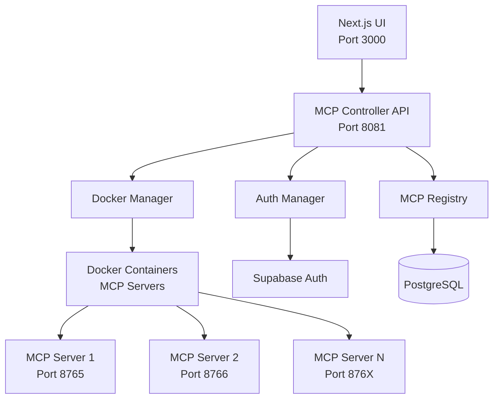

# σ₂: System Patterns - MCP Server Controller
*v1.0 | Created: 2025-04-09 | Updated: 2025-07-05*
*Π: DEVELOPMENT | Ω: EXECUTE*

## 🏛️ Architecture Overview
Docker 기반 MCP 서버 컨트롤러 시스템으로, FastAPI를 통한 REST API와 SSE 실시간 통신을 제공하며, FastMCP v2.10.0+의 미들웨어 시스템을 활용한 엔터프라이즈급 관리 솔루션.



## 🧩 Key Components

[K₁] **MCP Controller API**: FastAPI 기반 중앙 제어 서비스
- RESTful API 엔드포인트 제공
- SSE를 통한 실시간 로그 스트리밍
- JWT 인증 미들웨어 통합

[K₂] **Docker Manager**: 컨테이너 생명주기 관리
- 동적 컨테이너 생성/삭제
- 헬스체크 및 자동 재시작
- 볼륨 마운트 및 네트워크 격리

[K₃] **MCP Registry**: 서버 메타데이터 관리
- 서버 설정 및 상태 저장
- 다중 서버 인스턴스 추적
- 서버 디스커버리 서비스

[K₄] **Auth Manager**: 인증 및 권한 관리
- JWT 토큰 자동 갱신
- Bearer 토큰 검증
- 사용자별 권한 제어

[K₅] **FastMCP Middleware Stack**: 횡단 관심사 처리
- LoggingMiddleware: 모든 MCP 통신 로깅
- AuthMiddleware: 토큰 검증 및 갱신
- MonitoringMiddleware: 성능 메트릭 수집
- RateLimitMiddleware: API 호출 제한

## 🧪 Design Patterns

[P₁] **Repository Pattern**: 데이터 접근 추상화
- MCP 서버 메타데이터 관리
- 데이터베이스 독립성 확보

[P₂] **Factory Pattern**: 동적 서버 생성
- 설정 기반 MCP 서버 인스턴스 생성
- 미들웨어 스택 동적 구성

[P₃] **Observer Pattern**: 실시간 이벤트 전파
- SSE를 통한 로그 스트리밍
- 서버 상태 변경 알림

[P₄] **Middleware Chain Pattern**: 요청 처리 파이프라인
- FastMCP 미들웨어 체인
- 횡단 관심사 분리

[P₅] **Singleton Pattern**: 글로벌 서비스 인스턴스
- Docker 클라이언트 관리
- Registry 서비스 인스턴스

## 🔄 Data Flow

### 서버 시작 플로우
```
flowchart LR
    USER[User] --> UI[UI: Start Button]
    UI --> API[API: POST /servers/{id}/start]
    API --> AUTH1[Auth Check]
    AUTH1 --> REG[Registry: Get Config]
    REG --> DM[Docker Manager: Create Container]
    DM --> DOCKER[Docker API]
    DOCKER --> CONT[New Container]
    CONT --> MCP[MCP Server Running]
    MCP --> SSE[SSE: Status Update]
    SSE --> UI2[UI: Update Status]
```

### 실시간 로그 스트리밍
```
flowchart LR
    MCP[MCP Server] --> LOG[Log Output]
    LOG --> DOCKER[Docker Logs API]
    DOCKER --> DM[Docker Manager]
    DM --> SSE[SSE Stream]
    SSE --> UI[UI: Log Viewer]
```

## 🔍 Technical Decisions

[D₁] **FastAPI 선택**: 고성능 비동기 처리와 자동 API 문서화 [↗️σ₃:FastAPI]
[D₂] **Docker SDK 사용**: 프로그래밍 방식의 컨테이너 제어 [↗️σ₃:Docker]
[D₃] **SSE over WebSocket**: 단방향 스트리밍에 적합하고 프록시 친화적
[D₄] **FastMCP 미들웨어**: 확장 가능한 횡단 관심사 처리
[D₅] **PostgreSQL + pgvector**: 기존 인프라 활용 및 확장성

## 🔗 Component Relationships

### 의존성 그래프
```
MCP Controller API
├── Docker Manager (컨테이너 제어)
├── MCP Registry (메타데이터 관리)
├── Auth Manager (인증/인가)
└── FastMCP Middleware
    ├── LoggingMiddleware
    ├── AuthMiddleware
    ├── MonitoringMiddleware
    └── RateLimitMiddleware

Docker Manager
├── docker-py SDK
└── Container Health Monitor

MCP Registry
├── PostgreSQL Driver
└── Cache Layer (선택적)

Auth Manager
├── Supabase Client
└── JWT Library
```

## 🛡️ Security Architecture

[SEC₁] **네트워크 격리**: Docker 네트워크를 통한 서비스 격리
[SEC₂] **인증 계층화**: API Gateway → Bearer Token → Container Access
[SEC₃] **로그 마스킹**: 민감정보 자동 필터링
[SEC₄] **Rate Limiting**: DDoS 방어 및 리소스 보호

---
*σ₂ captures system architecture and design patterns*